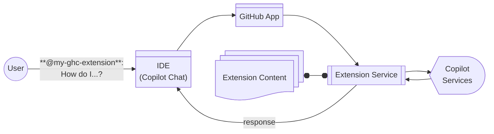

## Step 1: Preparing to make your extension

Welcome to **"Your first extension for GitHub Copilot"** exercise! :robot:

We will be making an extension for GitHub Copilot by creating a web service, connecting to a GitHub App, and customizing it to our needs (the staff of a high school). But before we get started, let's learn a bit more about extensions.

### What is a GitHub Copilot Extension?

A [GitHub Copilot Extension](https://github.com/features/copilot/extensions) is an add-on that provides customized abilities for GitHub Chat and github.com. That means, it can be more dynamic and include consistent context.

For example:

- **Querying documentation**: A Copilot Extension can allow Copilot Chat to query a third-party documentation service to find information about a specific topic.
- **AI-assisted coding**: A Copilot Extension can use a third-party AI model to provide code suggestions.
- **Data retrieval**: A Copilot Extension can allow Copilot Chat to query a third-party data service to retrieve information about a specific topic.
- **Action execution**: A Copilot Extension can allow Copilot Chat to execute a specific action, such as posting to a message board or updating a tracking item in an external system.

In fact, you can even publish your extension on the [GitHub Marketplace](https://github.com/marketplace?type=apps&copilot_app=true) to share it with the world!

> Ref: For more information, see the [About building extensions](https://docs.github.com/en/copilot/building-copilot-extensions/about-building-copilot-extensions) page.

### How do I make an extension?

Creating an extension is fairly easy. It includes 3 parts, which we will learn in this lesson.
Naturally, the web service must be hosted, but that is covered in another lesson. For this exercise, we will use a [Codespace](https://github.com/features/codespaces).

1. **GitHub App** - Enables message handling and communicating with GitHub Copilot.
1. **Extension Service** - A standard web service for receiving the messages, performing the custom actions, and responding back to GitHub Copilot.
1. **Extension Content** - Materials provided to your extension to customize it for your application.

> [!IMPORTANT]
> A [GitHub Copilot Extension](https://github.com/features/copilot/extensions) is _NOT_ the [GitHub Copilot VS Code Extension](https://marketplace.visualstudio.com/items?itemName=GitHub.copilot) found in your IDE, but rather an extra capability to enhance it.

### Ok, let's get to developing! :mechanical_arm:

Before we get started on your extension, we have to configure our development environment.
Fortunately, this has been bootstrapped for us with a pre-configured [Codespace](https://github.com/features/codespaces).

This development environment includes:

- The Node.js runtime.
- A template GitHub Extension (javascript web app service).
- [VS Code](https://code.visualstudio.com/) launch settings to start your extension in debug mode.

### :keyboard: Activity: Getting to know your extension development environment

1. Right-click the below button to open the **Create Codespace** page in a new tab.

   

   - The free tier of Codespaces that comes with all GitHub accounts is fine, assuming you still have minutes available.
   - The default Codespace settings are fine.
   - This repository will provide the additional settings and files for making your extension.

1. Confirm the **Repository** field is your copy of the exercise, not the original, then click the green **Create Codespace** button.

   - ✅ Your copy: `/{{{full_repo_name}}}`
   - ❌ Original: `/skills/your-first-extension-for-github-copilot`

1. Wait a moment for Visual Studio Code to load.

1. Before we continue let's take a moment to familiarize ourselves with the project folder.

   - The left navigation bar is where you can access the file explorer, debugger, and search.
   - The lower panel (Ctrl+J) shows the debugger output, allows running terminal commands, and allows configuring the web service ports.
   - Our template extension is in the `ghc-extension-js` folder. More on that in the next steps!
   - The `index.js` file is the entry point for the extension and hosts the web service for Copilot to interact with.
   - The `package-lock.json` and `package.json` files define the extension's dependencies.

1. Create a new branch named `my-ghc-extension`. Ensure it is checked out in VS Code and published to GitHub.

   - Note: Creating this branch triggers the next step in your exercise.
